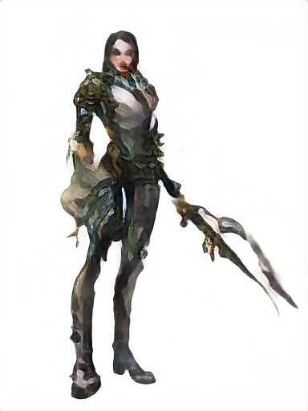
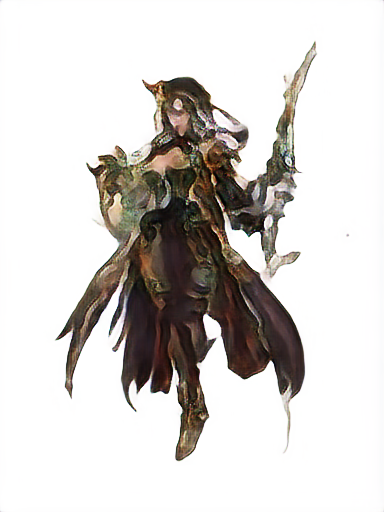
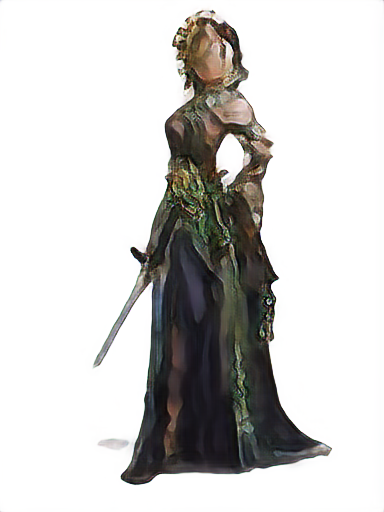
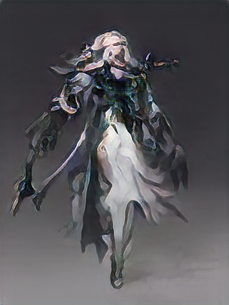
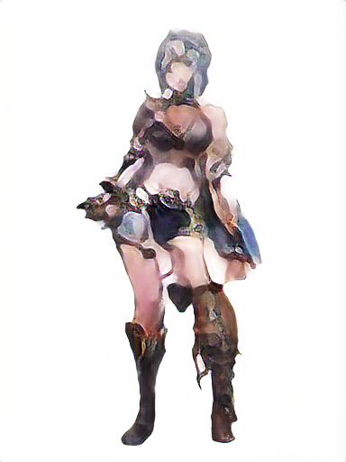
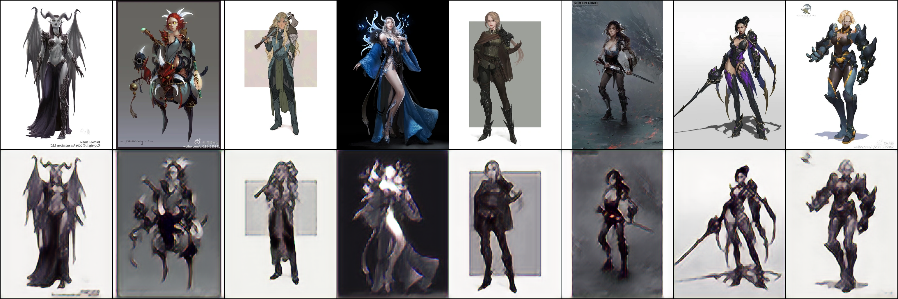
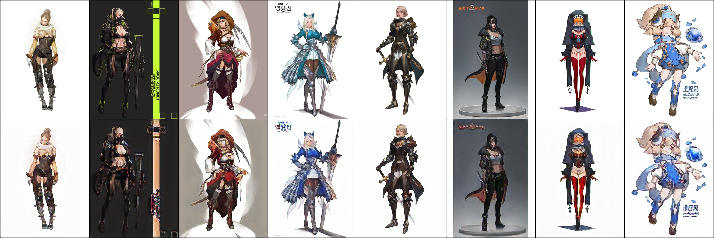
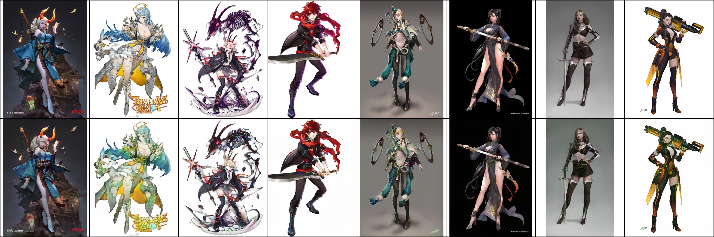

<p align="center">
  <h1 align="center">Latent VQGAN Diffuser</h1>
  <p align="center">
    <strong>Training a latent generative image pipeline from scratch on consumer-grade hardware.</strong>
    <br />
    VQGAN-style autoencoder + latent diffusion + EDM-inspired diffusion design, trained end-to-end on a single RTX 4080.
  </p>
</p>

<p align="center">
  <a href="https://arxiv.org/abs/2112.10752">Latent Diffusion Models</a>
  ·
  <a href="https://arxiv.org/abs/2206.00364">Elucidating Diffusion Models</a>
</p>

---

## Favorite generations

These samples come from the full pipeline: images are compressed into a learned latent space, a diffusion model learns to generate in that latent space, and the decoder maps generated latents back into pixels.

<table>
  <tr>
    <td></td>
    <td></td>
  </tr>
  <tr>
    <td></td>
    <td></td>
  </tr>
  <tr>
    <td colspan="2" align="center"></td>
  </tr>
</table>

---

## This Project

This repo is my attempt at building a modern image generation stack from the ground up:

* **A learned image tokenizer / autoencoder** that compresses images into a lower-dimensional latent representation.
* **A latent diffusion model** trained over those compressed representations rather than directly over pixels, following the central efficiency idea from *High-Resolution Image Synthesis with Latent Diffusion Models*.
* **A diffusion training and sampling procedure influenced by EDM**, following the perspective from *Elucidating the Design Space of Diffusion-Based Generative Models*: clean noise schedules, explicit denoising behavior, and a modular separation between model, sampler, and training objective.

---

## Autoencoder training progression

Before the diffusion model can learn the latent world, the autoencoder has to learn how to compress and reconstruct images. The progression below shows the decoder becoming steadily more coherent as the latent space becomes useful.

<table>
  <tr>
    <th>~500 steps<br /><sub>about 15 min</sub></th>
    <th>~5,000 steps<br /><sub>about 150 min</sub></th>
    <th>~19,000 steps<br /><sub>about 10 hrs</sub></th>
  </tr>
  <tr>
    <td></td>
    <td></td>
    <td></td>
  </tr>
</table>

---

## Pipeline

```text
training images
      │
      ▼
VQGAN-style autoencoder
      │        learns a compressed visual latent space
      ▼
latent tensors
      │
      ▼
EDM-inspired diffusion model
      │        learns to denoise and sample in latent space
      ▼
generated latents
      │
      ▼
decoder
      │
      ▼
generated images
```

---

## Why latent diffusion?

Pixel-space diffusion is expensive and hard: See my previous repo, Generative Denoising Diffusers

---

## References

* Robin Rombach, Andreas Blattmann, Dominik Lorenz, Patrick Esser, Björn Ommer — [High-Resolution Image Synthesis with Latent Diffusion Models](https://arxiv.org/abs/2112.10752)
* Tero Karras, Miika Aittala, Timo Aila, Samuli Laine — [Elucidating the Design Space of Diffusion-Based Generative Models](https://arxiv.org/abs/2206.00364)
